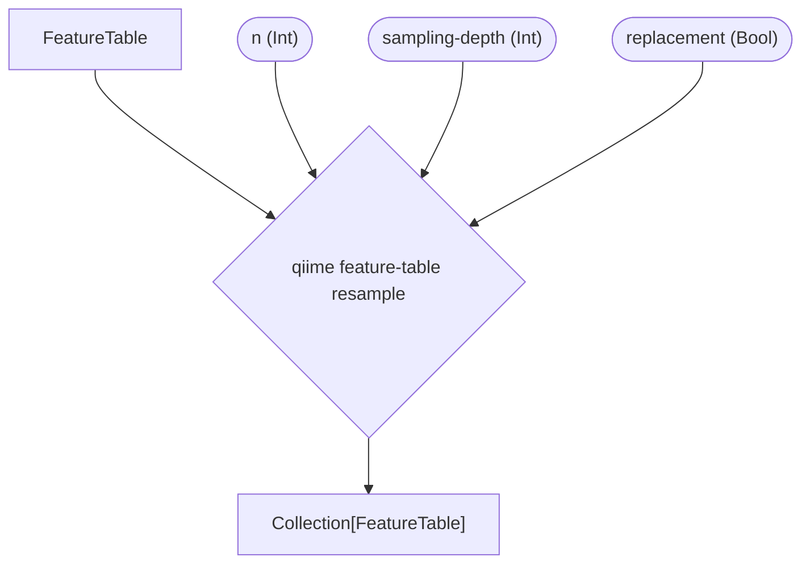
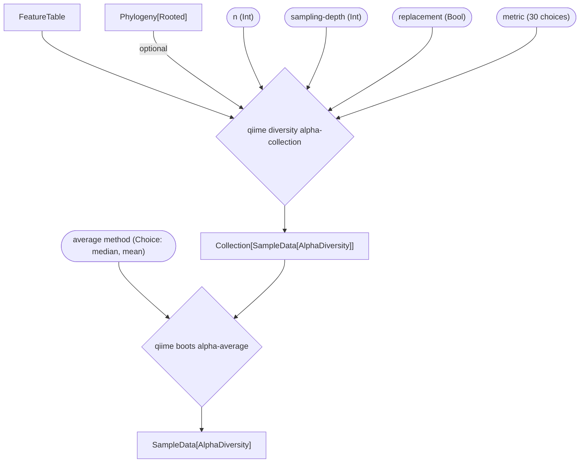
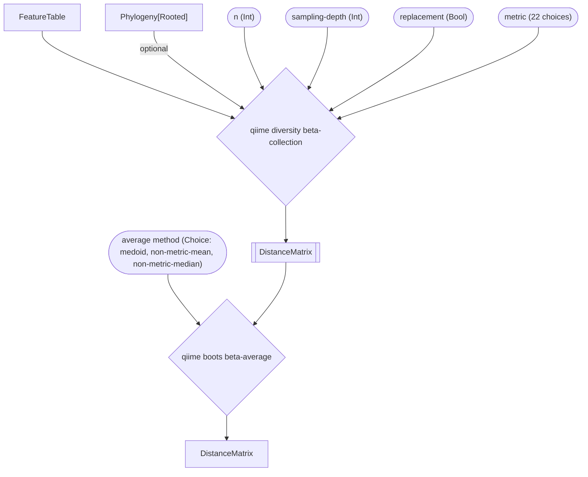

# (A) `resample` `Pipeline`


# (B) `alpha` `Pipeline`




# (C) `beta` `Pipeline`



```mermaid
flowchart LR
    function-call{QIIME 2 `Action`}
    QIIME 2 `Artifact`
    parameter([parameter])

    style Beta fill:#CC6677
    style Alpha fill:#88CCEE
    AB[Alpha and Beta]
    style AB fill:#DDCC77
    core-metrics[Core Metrics]
    style core-metrics fill:white
```